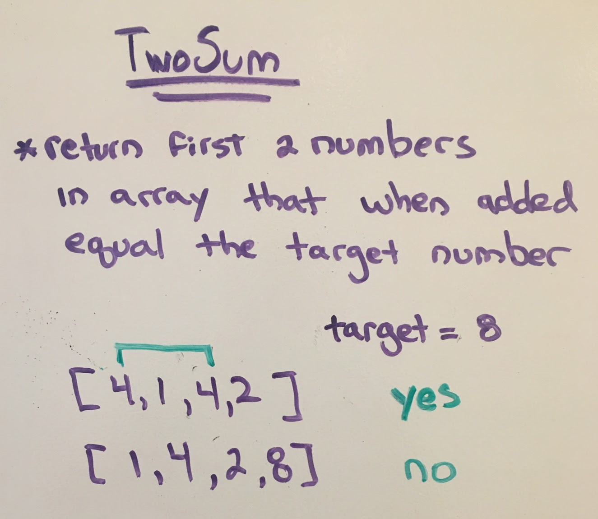
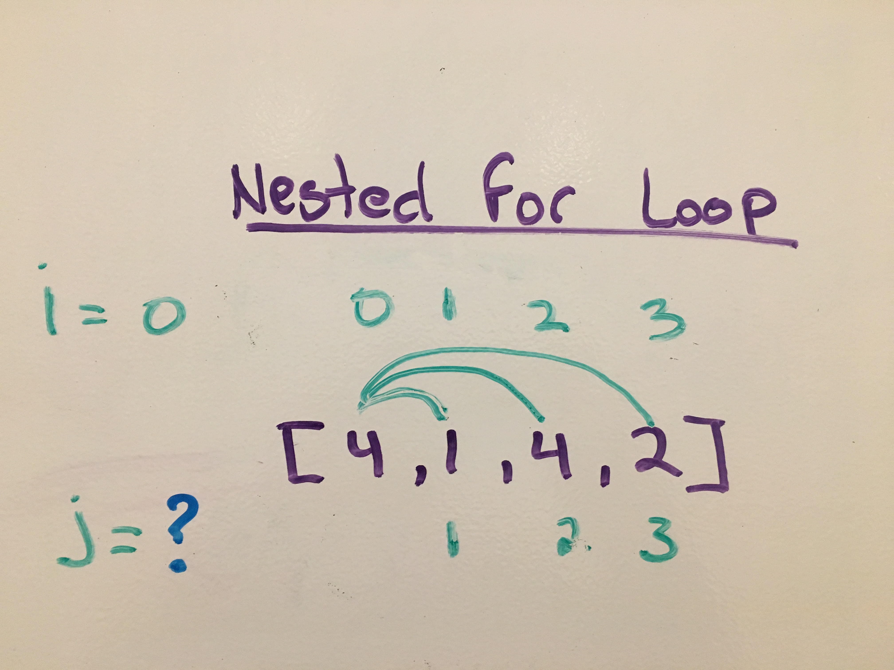
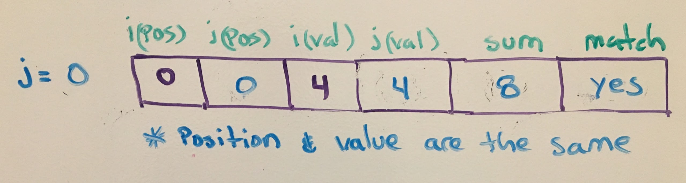
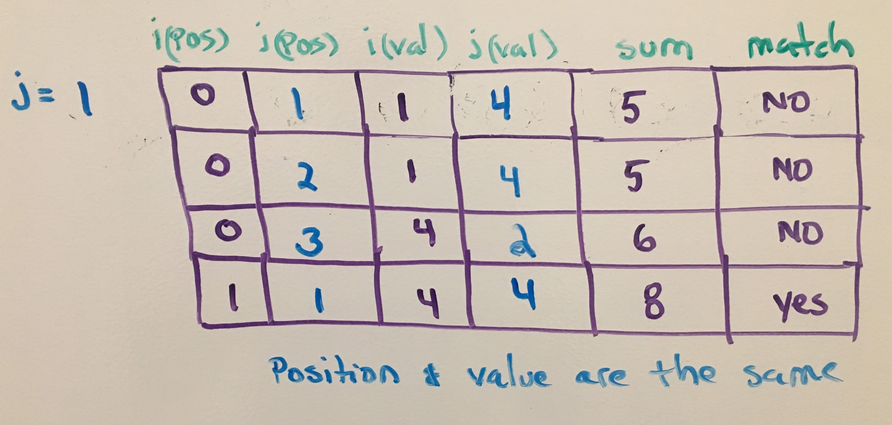
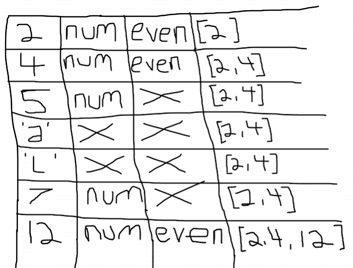
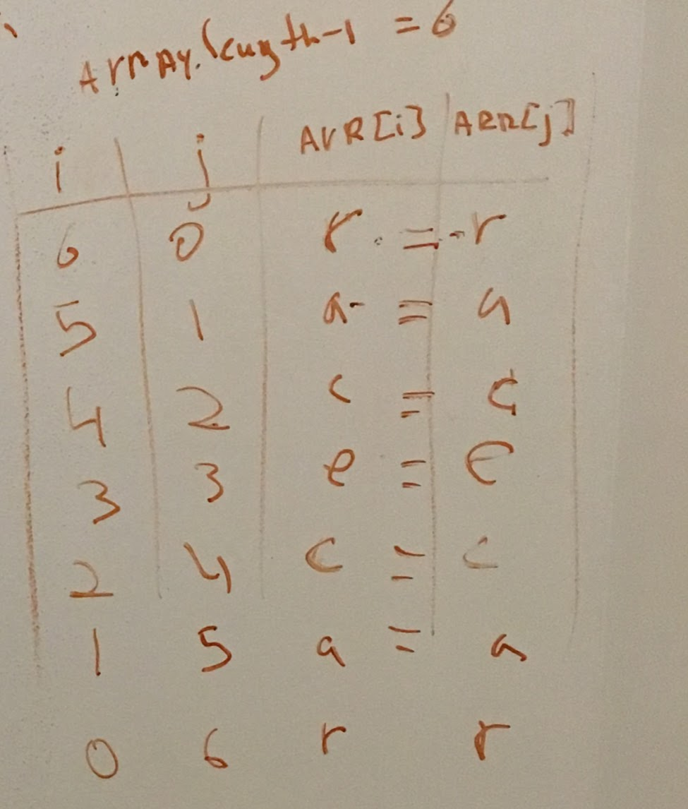

# Whiteboarding

[https://tinyurl.com/wdi-nyc](https://tinyurl.com/wdi-nyc)

Whiteboarding interviews are somewhat controversial these days, as critics point out that the ability to memorize algorithms doesn't necessarily equate to the ability to write good software. Nevertheless, many companies still use whitebarding interviews, and you should be prepared in case you get thrown into one.

## Writing Good Pseudocode

Work in progress...so be patient...

## Visualizing the Problem

One of the requirements of any whiteboarding interview is that you verbally walk the interviewer through your thought process.  Part of that process should incorporate using the whiteboard to visualize the problem.  This can be as simple as drawing out an array of integers and using a table to simulate an interation by keeping track of the current index, it's value and if it meets some criteria. 

Here are some visualization techniques that can help with this process.

- Drawing out the solution, answer and edge case(s)
- Use tables to keep track of postions, values, conditions 

Let's incorporate these techniques as we attempt to solve one our favorite algo's....**TwoSum**.   The first thing we do is rewrite the objective of the problem and create two arrays, one that has two values that equal the target and one that doesn't.  

Of course there are additional edge cases that you could include but these two are good for now. 

Now that we know what a solution would look like let's move onto how we would approach returning the values.  Our first approach is to **brute force** is a nested for loop.  The image below is an attempt to work out what the starting value of **j** should be when we start the loop.  

If we set **j = 0** then we will add the same value to itself, which equals the sum but doesn't meet the criteria of 2 different numbers. 

So we need stay at least one ahead of **i**. If we set **j = 1** that would do the trick, at least for the first interation of **i** but we run into the same problem as before.

That leads us to think about how to consistently stay one value ahead of **i**.  The standard way of doing this is by setting **j = i + 1**.  

### Additional Visual Whiteboarding Examples

**Problem:** Take an array and return an array of only the even integers.

**Problem:** Palindrome

